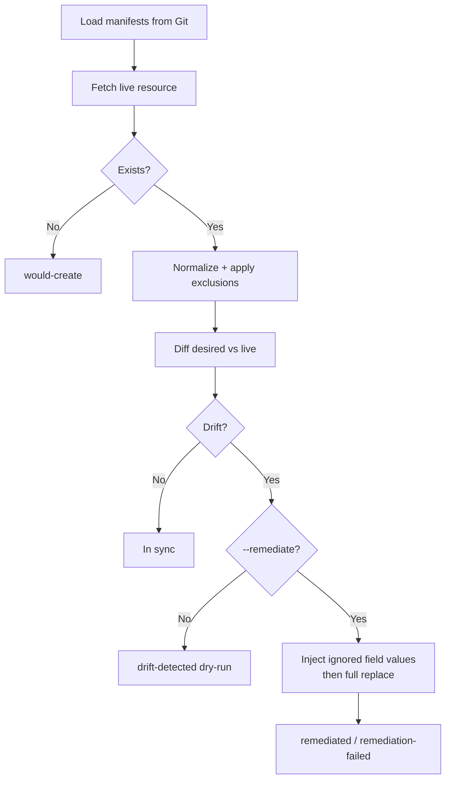

# Design Document: GitOps Drift Detection Controller



## 1. How do you define drift? What fields do you compare, and what do you explicitly ignore and why?

**Drift** is any difference between what a Kubernetes manifest in Git declares and what the live cluster actually holds, after stripping fields that Kubernetes manages automatically.

### What we compare

We compare every field that appears in the desired manifest. If the desired manifest declares `spec.template.spec.containers[name=app].image: nginx:1.25` and the live cluster has `nginx:1.19`, that is drift.

We use a one-directional comparison: fields present in the live object but absent from the desired manifest are not flagged. This is intentional. Kubernetes and admission webhooks inject defaults on resource creation: `imagePullPolicy`, `terminationMessagePath`, `defaultMode` on volume mounts, and many others. Flagging every injected default would produce a report that is impossible to act on. The assumption is that if you care about a field, you should declare it in your manifest.

### List diffing: semantic name-based matching

Lists of objects that all carry a `name` key (containers, init containers, volumes, environment variables, ports) are matched by name rather than by position. Kubernetes identifies containers by name, not index. Admission webhooks (Istio, Linkerd) frequently inject sidecars that shift positions. Positional comparison produces false positives; name-based matching does not.

```
# Desired
containers:
  - name: app
    image: nginx:1.25
  - name: sidecar
    image: envoy:v1.0

# Live (Istio injected its sidecar at position 0)
containers:
  - name: sidecar
    image: envoy:v1.0
  - name: app
    image: nginx:1.25
```

Positional diffing produces two false diffs here. Name-based matching produces zero (correct). Lists without a consistent `name` key fall back to positional comparison.

### Immutable fields and representation drift

Some fields can drift but cannot be remediated with a replace. `spec.selector` on a Deployment is immutable after creation; a replace with a different selector will be rejected with HTTP 422. The controller logs `remediation-failed`, leaves the resource unchanged, and the same drift is reported on the next cycle. That alert repeats until an operator performs a delete-and-recreate, updates Git to match reality, or excludes the field.

The diff treats parsed YAML values as values, not source text. Kubernetes normalizes `defaultMode: 0644` to the integer `420`. Manifests should use the API representation (`420`); quoting it as `"0644"` changes the type to string and introduces spurious drift.

Service `spec.clusterIP` is assigned by Kubernetes and immutable. Desired Service manifests should omit it. If Git declares a `clusterIP` that differs from the live-assigned value, drift will be reported every cycle and remediation will fail repeatedly.

### What we explicitly ignore

**System-managed fields** (stripped before any comparison):

| Field | Reason |
|---|---|
| `metadata.resourceVersion` | Changes on every write; not part of desired state |
| `metadata.uid` | Assigned at creation; cannot be declared |
| `metadata.generation` | Incremented by the API server; not declarable |
| `metadata.creationTimestamp` | Set at creation; not declarable |
| `metadata.managedFields` | Server-side apply bookkeeping |
| `metadata.selfLink` | Deprecated; injected by older API servers |
| `status` | Cluster-managed; never part of desired state |
| `metadata.annotations["kubectl.kubernetes.io/last-applied-configuration"]` | kubectl injects this; encodes the full previous manifest as JSON and makes every diff noisy |

**Per-resource exclusions** (via annotation): Fields marked with `drift.gitops.io/ignore-fields` are intentionally allowed to drift. The canonical example is `spec.replicas` when an HPA manages scale.

**Global exclusions** (via `--ignore-fields`): A comma-separated list of paths to exclude from every resource in the run. Useful for fields consistently managed externally across an entire cluster.

---

## 2. How does the exclusion mechanism work? What are its limits?

There are two exclusion annotations and one global CLI flag.

### Resource-level skip

`drift.gitops.io/skip: "true"` on a manifest causes the controller to skip that resource. No fetch, no diff, no report entry. The reconciler checks this before touching the API server.

Use cases: a ConfigMap owned entirely by a third-party operator; a Deployment intentionally diverged during a canary rollout; a resource being migrated.

### Field-level ignore

The annotation `drift.gitops.io/ignore-fields` on a desired manifest accepts a comma-separated list of dot-notation paths:

```yaml
metadata:
  annotations:
    drift.gitops.io/ignore-fields: "spec.replicas,metadata.labels.env"
```

At reconciliation time, `reconciler.py` reads this annotation from the desired manifest and passes the paths to `normalizer.normalize()`. The normalizer removes those paths from both the desired and live objects before diffing. Because removal happens on both sides, the field disappears from the comparison entirely: it is neither detected as drift nor reported.

The normalizer uses a path-split traversal: `spec.replicas` becomes `["spec", "replicas"]`, and `_delete_path` recurses through dictionaries, deleting the final key.

### Limits

**No list-index exclusions.** The path parser splits on `.` and does not understand bracket notation. You cannot exclude `spec.template.spec.containers[0].image`; the traversal looks for a literal key named `containers[0]`. Named-bracket notation (`spec.template.spec.containers[name=demo-app].image`) is also unsupported, even though the diff engine uses that syntax in its output. Copying a path directly from a drift report into the annotation silently does nothing. The workaround is to exclude the whole parent (`spec.template.spec.containers`), which hides all changes under that subtree.

**Desired-side annotation only.** The annotation is read from the desired manifest in Git, not from the live object. It cannot be applied at runtime without a Git commit.

**Exact path removal only.** Ignoring `spec.replicas` removes only that field and keeps sibling fields visible. Ignoring a parent path such as `spec.template` removes the whole subtree, so it should be used carefully.

**No wildcard or pattern matching.** Paths must be exact dot-notation strings.

---

## 3. What is the difference between drift that should alert and drift that should auto-remediate? How does the system decide?

The current system does not make this distinction automatically. The mode is set at run time by the operator, not inferred from the nature of the drift. This is a deliberate scope decision: the tool is not a policy engine.

**Alert-only drift** is drift where human judgment is required before acting. An image tag change might be an intentional hotfix or a security incident; both warrant review before the old image is restored. A label being added might be load-balancer or service-mesh traffic routing that was applied manually for a specific reason. A resource missing from the cluster may have been intentionally deleted to shed load during an incident. In all these cases, the right first response is to understand what happened, not to immediately re-apply the manifest.

The controller cannot tell the difference between these cases: an image change could be an on-call engineer's rollback or a compromised pipeline; a replica count change could be the HPA working normally or someone scaling down to shed load during an incident.

**Auto-remediable drift** is drift where restoring Git state is always safe and has no external side effects. A ConfigMap field that was edited to `kubectl edit` and whose owning application tolerates a hot-reload is a candidate. Resource requests and limits that were bumped as a temporary measure are another. Even then, ConfigMap remediation is not automatically safe: workloads that do not hot-reload ConfigMaps require a pod restart before the new value takes effect, and updating a ConfigMap that controls feature flags or credentials is an application-visible change, not harmless metadata.

**How the system decides in practice:** `--dry-run` is on by default. A human must explicitly pass `--remediate` for any write to reach the cluster. `--remediate` overrides `--dry-run` regardless of flag order.

| Flags passed | Effective mode | Action string |
|---|---|---|
| *(none)* | dry-run | `drift-detected (dry-run)` |
| `--dry-run` | dry-run | `drift-detected (dry-run)` |
| `--no-dry-run` | alert only, no writes | `drift-detected` |
| `--remediate` | remediate | `remediated` or `remediation-failed: <error>` |
| `--dry-run --remediate` | remediate (`--remediate` wins) | `remediated` or `remediation-failed: <error>` |

When a resource is absent from the cluster entirely, the action is `would-create (dry-run)` in dry-run mode and `would-create` otherwise.

The operator reviews the dry-run report and decides whether to re-run with `--remediate`. When `--remediate` is active, every drifted resource is re-applied. This is an intentionally blunt instrument. A simple extension: add a per-resource annotation such as `drift.gitops.io/remediation-policy: auto|alert` and check it in `reconciler.py` before calling `remediator.remediate()`. Per-resource policy overrides the global flag without a CLI change.

### How exclusions and remediation interact

The exclusion mechanism and the remediation path have a silent failure mode that is easy to miss. The naive implementation contains a silent data-loss bug: when a field is excluded from diff detection, it is removed from the comparison, but the remediation body is built from the original manifest, which still contains the manifest's declared value for that field. A full replace with that body sends the manifest's value to the API server, silently overwriting what an HPA or operator set.

Concretely: if `spec.replicas` is in the ignore list and an HPA has scaled the Deployment to 7 replicas, the manifest still says `spec.replicas: 2`. A replace with the unmodified manifest sends `spec.replicas: 2` to Kubernetes. The HPA's work is undone. The field was "excluded from drift detection" but not from the write operation.

The fix implemented in this controller: before constructing the apply body, for each ignored field, the controller reads the current live value from the cluster and injects it into the manifest copy. Ignored fields are preserved from the live object when present; if the field is absent in live state, the desired value may be reintroduced by the replace. The test `test_remediation_preserves_ignored_fields_from_live` exercises the common HPA case explicitly.

**Why full replace instead of server-side apply (SSA):** SSA with a named field manager is the production-correct approach. SSA tracks which manager owns which fields; the controller only asserts ownership over fields it has explicitly applied. `spec.replicas` owned by the HPA controller is left untouched regardless of what the apply body contains, making the exclusion annotation unnecessary for most HPA cases. The production implementation would use:

```python
api.patch_namespaced_deployment(
    name=name,
    namespace=namespace,
    body=manifest,
    field_manager="gitops-drift-controller",
    force=False,  # do not steal ownership from other managers
)
```

with `Content-Type: application/apply-patch+yaml`. Full replace was chosen here because the Python client's SSA support adds serialization and ownership-model complexity that is out of scope for this tool. The live-value injection fix makes full replace safe for the HPA case; immutable-field failures (HTTP 422) are caught, logged as `remediation-failed`, and re-reported on the next cycle.

---

## 4. Kubernetes mutates resources after apply by adding resourceVersion, managedFields, etc. How do you handle this in diff logic?

The `normalizer.normalize()` function strips API-server-injected fields from both the desired and live object before passing them to `compute_diff()`. This happens in both directions:

- **Desired object**: The local YAML manifest does not contain these fields, but we still run it through `normalize()` for safety (e.g. if someone accidentally copies a `resourceVersion` into their manifest).
- **Live object**: The API server always returns these fields. Stripping them ensures we only compare what was intentionally declared.

The stripped paths are defined in `normalizer.py` as `_system_paths`, including snake_case equivalents returned by the Python client's `to_dict()`: `metadata.resource_version`, `metadata.managed_fields`, `metadata.creation_timestamp`. The `kubectl.kubernetes.io/last-applied-configuration` annotation is stripped because it encodes the previous manifest as JSON and would show up as a change in every diff.

After normalization, the diff is purely value-based: two normalized objects are in sync if and only if every field declared in the desired object has the same value in the live object.

Two edge cases are intentionally left visible. `metadata.ownerReferences` may be added by controllers that adopt resources; removing it breaks garbage-collection ownership. `metadata.finalizers` follow one-directional semantics: a finalizer present in Git but missing from live is drift; a live-only finalizer is ignored (it is owned by whatever controller manages deletion).

---

## 5. What would a production deployment of this controller look like? How does it run, and how does it fail safely?

### Deployment

The controller runs as a single-replica Deployment in a dedicated namespace (`drift-system`). Without leader election it must not run as multiple active replicas; two concurrent instances can both detect drift and race on remediation, producing conflicting replace calls and noisy logs.

Desired-state manifests are mounted from a Git-synced volume (a sidecar running `git-sync` that pulls from the GitOps repository and writes to a shared `emptyDir`). A stale `git-sync` checkout is a meaningful failure mode: the controller may compare the cluster against an old commit and either miss real drift or remediate away a valid newer change. The commit SHA is logged on every reconciliation cycle and should be exported as a metric.

The controller uses a ServiceAccount with a ClusterRole granting `get` on supported resources, plus `create` and `update` when remediation is enabled. The README includes a simple RBAC example that also grants `list`, which is useful if the controller later adds inverse-drift detection.

```
drift-system/
  Deployment: drift-controller (1 replica)
    - sidecar: git-sync (pulls GitOps repo, writes to /manifests)
    - main:    gitops-drift --manifests /manifests --interval 60
  ServiceAccount: drift-controller
  ClusterRole:    get/list/create/update on Deployments, Services, ConfigMaps, Namespaces
  ClusterRoleBinding: drift-controller → drift-controller SA
```

### Failure modes and safety

**API server unavailable:** The reconciliation loop catches exceptions around each `fetch_live_resource` call and continues to the next resource. If the API server is completely unreachable, the loop logs errors for each resource and sleeps until the next interval. It does not crash or exit.

**Manifest parse error:** If a YAML file is malformed, the loader logs a warning and skips it. The remaining manifests are still processed.

**Remediation failure:** `remediator.remediate()` catches any exception, logs the error, and returns a `remediation-failed: <error>` string. This appears in the drift report but does not abort the loop. The same resource will be checked again on the next cycle.

**Invalid configuration:** The only hard exit is an invalid kubeconfig or inability to authenticate, caught at startup and exiting with status 1. Kubernetes restarts the container, and the pod's back-off delay prevents a tight crash loop.

**Dry-run by default:** The controller defaults to dry-run mode. A misconfigured deployment cannot accidentally modify the cluster. Remediation requires an explicit `--remediate` flag.

**Graceful shutdown:** The controller handles both SIGTERM (from the container orchestrator on pod deletion) and SIGINT (Ctrl-C in development). On either signal it completes the current reconciliation cycle and exits cleanly, avoiding a half-processed state.

**No state persistence:** The controller is stateless. It does not write to etcd or any external store. If killed mid-cycle, the next run starts fresh. The tradeoff is no drift history or alert suppression; persistent drift will generate a report on every cycle until fixed.

---

## 6. Production Architecture: Polling vs. Informers

The current implementation polls: every `--interval` seconds it issues one `Get` per tracked resource and compares against the manifest. This is correct for a small, scoped manifest set. The tradeoff is that detection latency is bounded by the interval, not by the time a change propagates through the watch stream.

At scale the right approach is informers: a `List` + `Watch` stream that delivers change events in near-real-time and backs a local cache, replacing O(n) `Get` calls per cycle with a single persistent connection per resource type. Informers pair naturally with a rate-limiting work queue, which also handles retry back-off and deduplication. Any remediation-capable controller running multiple replicas needs leader election on top of that to avoid concurrent conflicting replaces.

Polling is fine for this tool at its current scope. The threshold for switching is roughly: manifest count large enough that per-cycle `Get` calls become a meaningful API server load, or a use case requiring sub-interval detection latency.

---

## 7. Remediation Strategy: Replace vs. Server-Side Apply

Full replace (`PUT /apis/apps/v1/namespaces/default/deployments/demo-app`) is semantically simple: the body becomes the new desired state, and Kubernetes applies defaulting and validation. The tradeoff is that the body must include a valid `resourceVersion` (to guard against lost updates), must not include immutable fields with different values, and must include all required fields. The controller fetches the current `resourceVersion` from the cluster inside `apply_manifest` before issuing the replace, so callers do not need to supply it. Omitting a defaulted field does not leave it unchanged; it resets it to its default.

This creates a correctness problem for ignored fields. A replace body built from the manifest's declared value for `spec.replicas` will overwrite whatever the HPA set, even if `spec.replicas` is in the ignore list. The fix in this controller reads the live value for each ignored field and injects it into the replace body before applying, making the replace a no-op for those fields.

**Server-side apply (SSA)** is the correct long-term approach. SSA introduces field ownership: when a manager (`field_manager`) first writes a field, it becomes that manager's property. Subsequent applies from the same manager can update only fields it owns. Fields owned by another manager (`spec.replicas` owned by the HPA's `horizontal-pod-autoscaler` manager) are left unchanged regardless of what appears in the body. This makes the ignore annotation unnecessary for the HPA case and avoids most immutable-field conflicts: the controller never claimed ownership of `spec.selector`, so it cannot accidentally change it.

The conflict model under SSA: if the drift controller attempts to apply a field currently owned by another manager, Kubernetes returns HTTP 409 Conflict. The caller can either back off (treat this field as if it were in the ignore list) or force-take ownership by setting `force=True`. Forcing is appropriate only when the controller is deliberately taking control of a field from another manager; it should be a deliberate operator decision, not a default.

This controller uses full replace for simplicity; the live-value injection described above makes it safe for the HPA case.

---

## Known Limitations

**No detection of extra live resources.** The controller only checks resources that appear in the manifest directory. If someone creates a Deployment manually in a watched namespace with no corresponding Git manifest, the controller does not report it. A complete GitOps audit tool would periodically list all resources in watched namespaces and flag any resource not represented in the manifest set (inverse drift detection). This is intentionally out of scope but is the next most valuable feature after SSA remediation.

**Not schema-aware.** The diff engine treats all field values as opaque scalars after YAML deserialization. It does not understand Kubernetes quantity semantics: `500m` CPU and `0.5` CPU are equivalent in Kubernetes but will produce a diff if one side uses one form and the other uses the other. `null` and an omitted field may be identical at the API level but will differ in the comparison if the manifest includes the key. Manifests should use the API-server canonical form, which is what `kubectl apply -f ... --dry-run=server -o yaml` returns.

**No list-index exclusions.** The `drift.gitops.io/ignore-fields` annotation does not support bracket notation (`spec.containers[0].image`). Exclusions apply to whole subtrees. Container-level exclusions require excluding the entire container list, which hides unrelated changes in the same list.

**Polling, not event-driven.** Detection latency is bounded by `--interval`. A manual change applied right after a reconciliation cycle will not be detected for up to `--interval` seconds. In production this is typically acceptable (60–300 seconds), but for security-sensitive workloads where a compromise must be detected in under a minute, an informer-based controller is required.

**Single cluster only.** The controller reads one kubeconfig context. Multi-cluster deployments require running one instance per cluster, with separate manifest directories or namespace-filtered views of a shared repository.

**Remediation uses full replace, not SSA.** As described in section 7, full replace is safe for the common HPA case (live-value injection for ignored fields) but will fail on immutable-field conflicts (HTTP 422) and does not handle field ownership. SSA is the recommended production migration.
