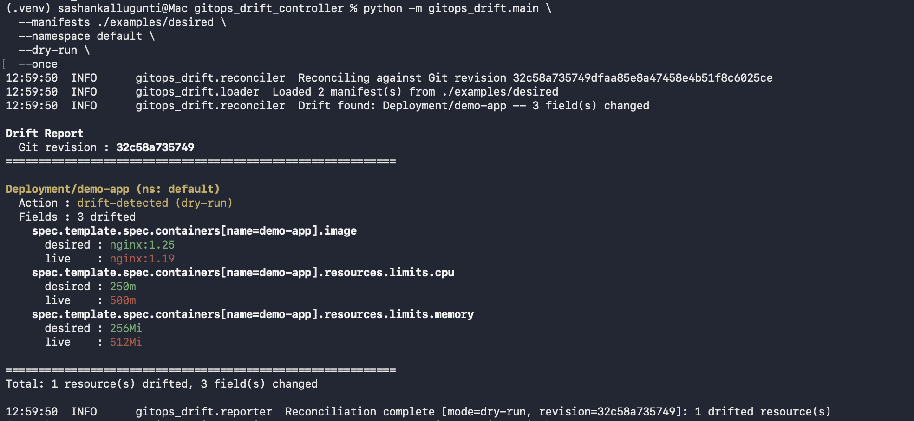

# GitOps Drift Detection Controller

A simple tool that checks whether your Kubernetes cluster (observed state) matches what’s in Git (desired state), and shows what changed when they go out of sync.

## Scope

The tool reads Kubernetes manifests, compares them with the current cluster state, and reports any drift. It also includes an optional remediation mode to re-apply the desired state.

This project is not intended to replace tools like ArgoCD or Flux. Those systems handle full GitOps workflows: sync orchestration, rollbacks, multi-cluster management, and integration with tools like Helm or Kustomize.

Keeping the scope small makes the behavior easier to reason about and allows it to be used alongside an existing GitOps setup rather than as a full platform.

## Design

The overall architecture, reconciliation loop, diff behavior, and remediation approach are documented in [DESIGN.md](DESIGN.md).

The focus is on keeping the reconciliation loop straightforward while correctly handling Kubernetes edge cases: defaulted fields and list reordering from sidecar injection.

## Runbook

[RUNBOOK.md](RUNBOOK.md) provides a step-by-step walkthrough to run the project locally using kind, including expected output and remediation flow.

## Demo

An end-to-end drift detection flow is available via:

- [`scripts/e2e-kind.sh`](scripts/e2e-kind.sh) for automated testing
- Manual drift simulation using `kubectl set image` and `kubectl patch` (see Quick Start below)
- [`scripts/docker-demo.sh`](scripts/docker-demo.sh) as an optional shortcut covering steps 1-4 without a local Python environment (see [RUNBOOK.md](RUNBOOK.md))

## Assumptions

This project intentionally focuses on a small subset of resources (`Deployment`, `Service`, `ConfigMap`, `Namespace`) and operates on a single cluster using plain YAML manifests.

It does not aim to be a full GitOps platform, alerting system, or history store. See [Assumptions and descoped areas](#assumptions-and-descoped-areas) for details.


## Quick start

```bash
# 1. Install dependencies (create a venv first to avoid touching system Python)
python3 -m venv .venv && source .venv/bin/activate
pip install -e ".[dev]"

# 2. Start a local cluster (requires kind)
./scripts/setup-kind.sh

# 3. Apply the example desired manifests
kubectl apply -f examples/desired/

# 4. Run dry-run detection (nothing drifted yet)
python3 -m gitops_drift.main --manifests ./examples/desired --namespace default --dry-run --once

# 5. Simulate drift
kubectl set image deployment/demo-app demo-app=nginx:1.19
kubectl patch deployment demo-app -p '{"spec":{"template":{"spec":{"containers":[{"name":"demo-app","resources":{"limits":{"cpu":"500m","memory":"512Mi"}}}]}}}}'

# 6. Detect drift
python3 -m gitops_drift.main --manifests ./examples/desired --namespace default --dry-run --once

# 7. Remediate
python3 -m gitops_drift.main --manifests ./examples/desired --namespace default --remediate --once
```

See [RUNBOOK.md](RUNBOOK.md) for a more detailed walkthrough, including cluster setup and expected output.

## CLI reference

```
python3 -m gitops_drift.main [options]

  --manifests PATH       Directory of desired-state YAML manifests (required)
  --namespace NAME       Default namespace when manifest omits one (default: default)
  --dry-run              Report drift without modifying the cluster (default: on)
  --no-dry-run           Disable dry-run; report drift without applying changes
  --remediate            Re-apply desired state when drift is found (disables dry-run)
  --once                 Run one reconciliation cycle and exit
  --interval SECONDS     Loop interval in seconds (default: 60)
  --kubeconfig PATH      Path to kubeconfig; defaults to ~/.kube/config
  --ignore-fields PATHS  Comma-separated global field paths to ignore
  --output FORMAT        Report output format: text | json (default: text)
  --log-level LEVEL      DEBUG | INFO | WARNING | ERROR (default: INFO)
  --fail-on-drift        Exit with status 1 if drift is detected (for CI pipelines)
```

## Example drift report

The controller reconciles all resources in the manifest directory in one cycle:

```
Drift Report
  Git revision : 3b0406bf9c1a
============================================================

ConfigMap/demo-app-config (ns: default)
  Action : drift-detected (dry-run)
  Fields : 1 drifted
    data.LOG_LEVEL
      desired : info
      live    : debug

Deployment/demo-app (ns: default)
  Action : drift-detected (dry-run)
  Fields : 2 drifted
    spec.template.spec.containers[name=demo-app].image
      desired : nginx:1.25
      live    : nginx:1.19
    spec.template.spec.containers[name=demo-app].resources.limits.cpu
      desired : 250m
      live    : 500m

Namespace/demo (ns: )
  Action : drift-detected (dry-run)
  Fields : 1 drifted
    metadata.labels.env
      desired : dev
      live    : staging

Service/demo-app (ns: default)
  Action : drift-detected (dry-run)
  Fields : 1 drifted
    metadata.labels.app
      desired : demo-app
      live    : demo-app-drift

============================================================
Total: 4 resource(s) drifted, 5 field(s) changed
```



Container paths use `[name=<container-name>]` notation. Containers are matched by name rather than position, so sidecar injection or reordering does not produce false positives.

## Exclusion mechanisms

Two annotations control what the controller checks.

### Skip an entire resource

```yaml
metadata:
  annotations:
    drift.gitops.io/skip: "true"
```

The resource is not fetched and does not appear in the drift report. Common cases: a ConfigMap managed by an external operator, a Deployment diverged intentionally during a canary rollout, or a resource mid-migration.

### Ignore specific fields

```yaml
metadata:
  annotations:
    drift.gitops.io/ignore-fields: "spec.replicas,metadata.labels.env"
```

The listed fields are excluded from the diff. During remediation, the controller reads the current live value for each ignored field and injects it into the replace body, so externally managed fields such as HPA-controlled `spec.replicas` are not reset.

The example deployment uses this to allow an HPA to manage `spec.replicas` without the controller treating every scale event as drift.

`--ignore-fields` applies the same exclusion to every resource in the run:

```bash
gitops-drift --manifests ./manifests --ignore-fields "spec.replicas"
```

## In-cluster deployment

When running inside Kubernetes, replace the kubeconfig approach with a ServiceAccount:

```yaml
apiVersion: v1
kind: ServiceAccount
metadata:
  name: drift-controller
  namespace: drift-system
---
apiVersion: rbac.authorization.k8s.io/v1
kind: ClusterRole
metadata:
  name: drift-controller
rules:
  - apiGroups: ["apps"]
    resources: ["deployments"]
    verbs: ["get", "list", "create", "update"]  # list included for future inverse-drift detection
  - apiGroups: [""]
    resources: ["services", "configmaps", "namespaces"]
    verbs: ["get", "list", "create", "update"]  # list included for future inverse-drift detection
---
apiVersion: rbac.authorization.k8s.io/v1
kind: ClusterRoleBinding
metadata:
  name: drift-controller
roleRef:
  apiGroup: rbac.authorization.k8s.io
  kind: ClusterRole
  name: drift-controller
subjects:
  - kind: ServiceAccount
    name: drift-controller
    namespace: drift-system
```

The Python client detects in-cluster configuration automatically when `KUBERNETES_SERVICE_HOST` is set. Remove the `--kubeconfig` flag and the code falls through to `load_incluster_config()`.

## CI pipeline usage

Use `--once --fail-on-drift` together to return a non-zero exit code when drift is detected, which makes this useful as a CI gate:

```bash
gitops-drift --manifests ./manifests --dry-run --once --fail-on-drift --output json
```

Exit code 0 means no drift was detected. Exit code 1 indicates drift. The JSON output can be parsed with `jq` for structured reporting.

## E2E test against a local cluster

Activate the venv first, then run:

```bash
source .venv/bin/activate
./scripts/e2e-kind.sh               # drift detection only
REMEDIATE=true ./scripts/e2e-kind.sh  # also test remediation
```

See [scripts/e2e-kind.sh](scripts/e2e-kind.sh) for full details. Requires `kind`, `kubectl`, and `jq`.

## Assumptions and descoped areas

### Resource scope
Only `Deployment`, `Service`, `ConfigMap`, and `Namespace` are supported. `StatefulSet`, `DaemonSet`, `CronJob`, `Ingress`, and CRDs are not included. Adding support is straightforward mechanically, but each resource has its own update semantics and edge cases (for example, StatefulSet update strategies or CRD validation). Keeping the scope narrow makes the behavior easier to reason about.

### List diffing
Lists of objects with `name` keys are matched by name to avoid false positives from container reordering or sidecar injection. Lists without stable identifiers fall back to positional comparison.

### No multi-cluster support
The tool operates on a single kubeconfig context. Running across multiple clusters requires running separate instances.

### No history or alerting
The tool reports to stdout and logs. Integrating with systems like Prometheus, PagerDuty, or Slack is out of scope, but the structured output is intended to make that straightforward.

### No Helm or Kustomize
Manifests are expected to be plain YAML. Template rendering is treated as a separate concern.

---

## Design notes

### Why custom diff instead of deepdiff?
A small recursive diff keeps the implementation easy to follow and avoids introducing an external dependency. `deepdiff` is more feature-rich, but adds complexity that isn’t necessary for this scope.

### Why full replace instead of strategic merge patch?
Replace is predictable: the body you send becomes the new state. The tradeoff is that it can overwrite fields managed by other controllers, which is why ignored fields are preserved. Server-side apply is the safer production path.

### What breaks at scale?
The current implementation fetches each configured resource by name, which works fine for a small manifest set. At scale, this would move to informers and a work queue.

### How would you add StatefulSet support?
Add `StatefulSet` to `SUPPORTED_KINDS`, implement `_get`, `_create`, and `_replace` in `kubernetes_client.py`, and add test coverage. The diff and normalization logic remains unchanged.

### Why is dry-run the default?
Because the cost of an unintended apply is higher than the cost of requiring one extra flag. Any tool that modifies cluster state should require explicit opt-in.
